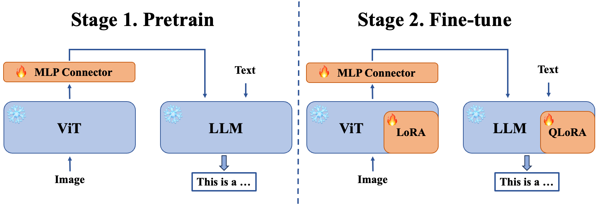

# Vision-Language-Assistant

  <!--  -->

  <h3 align="center">Vision-Language-Assistant</h3>
    

  

  <!-- 🔍 模型开源地址：

 -->

## 📖 目录
- [Vision-Language-Assistant](#Vision-Language-Assistant)
  - [🎉 更新](#-更新)
  - [📝 简介](#-简介)
  - [📖 Model Zoo](#-model-zoo)
  - [✏️ 快速开始](#%EF%B8%8F-快速开始)
    - [1. 算力要求](#1-算力要求)
    - [2. 基于 transformers 使用模型](#2-基于-transformers-进行推理)
    - [3. 通过网页前端体验 demo](#3-通过网页前端体验-demo)
    - [4. 基于 LMDeploy 高性能部署](#4-基于-lmdeploy-高性能部署)
  - [🧾 训练数据](#-训练数据)
  - [🧑‍💻 训练指南](#-训练指南)
  - [📚 应用体验](#-应用体验)
  - [🎖️ 致谢](#%EF%B8%8F-致谢)
  - [开源许可证](#开源许可证)

## 🎉 更新
- 待更新......

## 📝 简介
人类通过视觉、听觉、触觉、语言等多维感知来理解、感受世界，现今人工智能的发展正向着多维感知的方向不断发展，`Large Language Model` 的出现让通用强人工智能成为了可能，但是 `Large Language Model` 仅有文本模态，不足以满足人们意图需求，为此需要构建出能遵循多模式视觉和语言指令的智能助手，这样才能更好地完成现实任务。**本项目旨在构建出基于 `Large Language Model` 的视觉-语言助手，以实现多模态交互。**

多模态大模型(`Large multimodal model`)如今发展十分迅速，在开源社区中优秀的多模态大模型有 `InternLM-XComposer`、`InternVL`、`LLaVA`、`Qwen-VL`等。多模态大模型的架构包括`Vision Encoder`、`Project Layer`、`Large Language Model`，本项目将采用 LLaVA 的架构配置，基于 `InternLM` 系列大模型训练多模态大模型，实现多模态交互，构建出一个具有多模态交互能力的视觉-语言助手。

项目持续开发中，欢迎  Star⭐、PR 和 Issue。

## 📖 Model Zoo
|         Model          |   Train   |
| :-------------------:  | :------: |
|          ……           |    ……    |
<!-- |   LLaVA-InternLM2-Chat-7B   |  qlora   |
|          ……           |    ……    | -->
## ✏️ 快速开始

### 1. 算力要求

### 2. 基于 transformers 进行推理

### 3. 通过网页前端体验 demo

### 4. 基于 LMDeploy 高性能部署

## 🧾 训练数据

## 🧑‍💻 训练指南

## 📚 应用体验

## 🎖️ 致谢
- [OpenXLab](https://openxlab.org.cn/home)
- [InternLM](https://github.com/InternLM/InternLM/tree/main)

## 开源许可证

该项目采用 [Apache License 2.0 开源许可证](LICENSE)。同时，请遵守所使用的模型与数据集的许可证。
